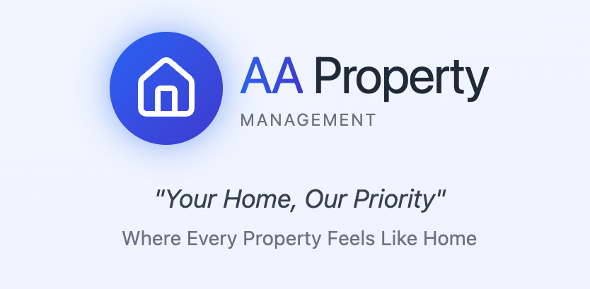

#  AAPropertyManagement
The purpose of AA Property Management is to streamline property management tasks, enabling landlords and tenants to efficiently handle rent payments, maintenance requests, and lease details. The name was inspired and is from the first initials of my two daughters named Athena &amp; Alison.

